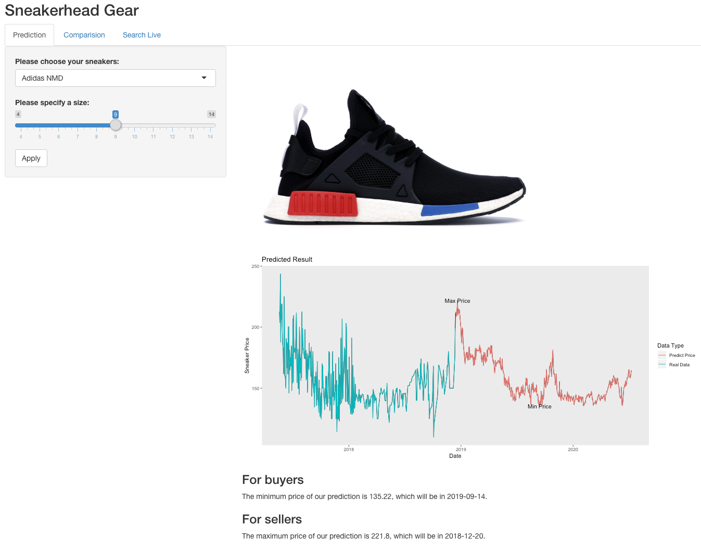
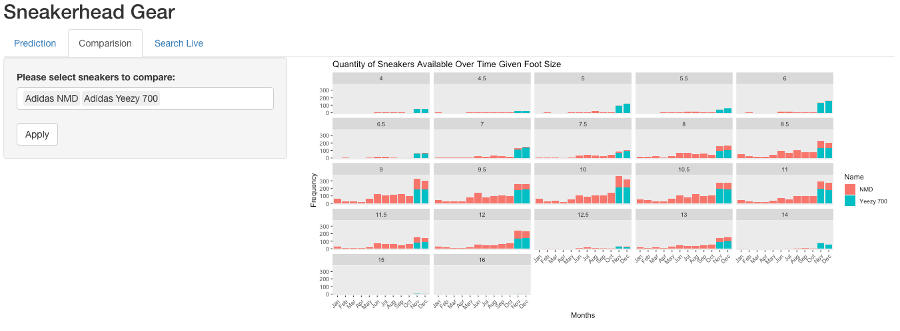
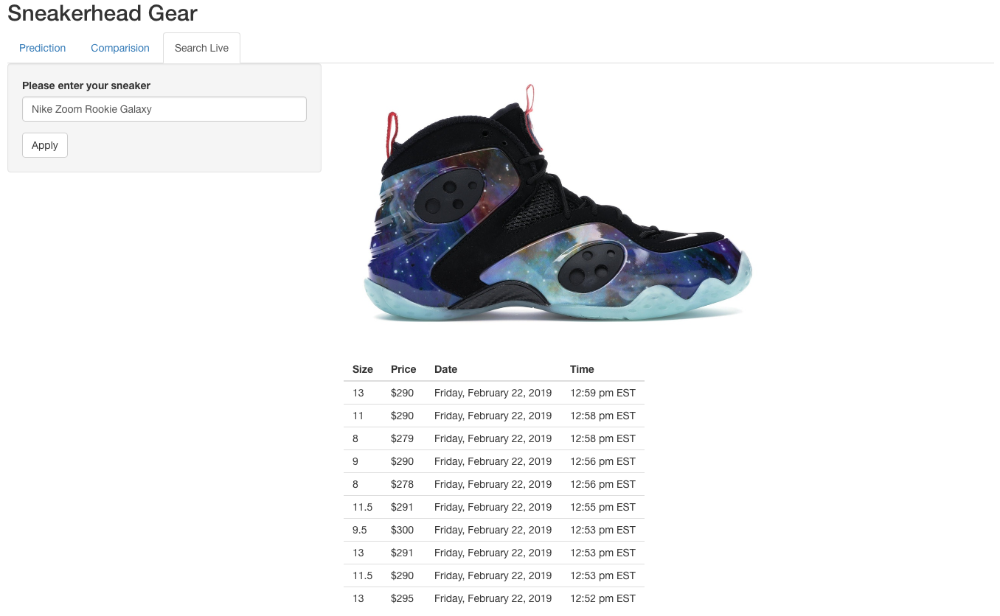
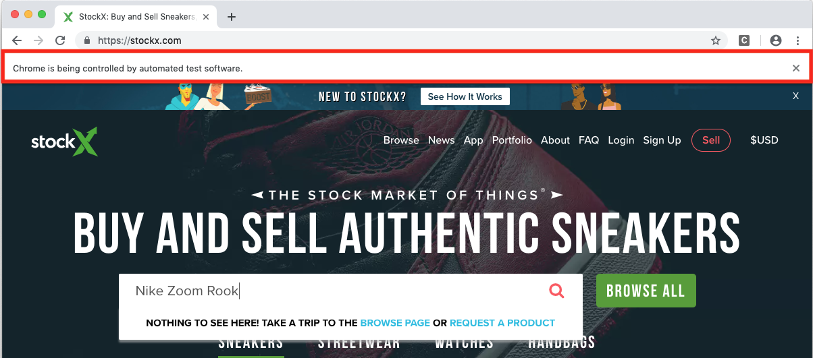

## Sneakerhead Gear Project

Within this repository is a donated project from Fall 2018 that was created in
STAT 385 by Ziwei Liu, Zepeng Xiao, and Yuquan Zheng. The goal of the project 
was to provide guidance as to the pricing of different kinds of sneakers. 
Students completed this work by using:

- Web Scraping Techniques requiring both `RSelenium` and `rvest`;
- Manipulating data using both `tidyr` and a host of base R functions;
- Modeling Sneaker Prices using `forecast`; and
- Communicating the result by creating a `shiny` Application that "wraps" their
  work.

### Usage

The package can be downloaded and used directly from GitHub with:

```r
# Install the package from GitHub
if(!requireNamespace("devtools")) { install.packages("devtools") }
devtools::install_github("stat385uiuc/demo-sneaker-project")

# Launch the Shiny Application
sneakers::run_sneakers()
```

### Examples

### Predictions 

After the application is launched and a user enters in one of the pre-specified
sneakers, they will see:



Within this portion of the application, the sneaker picture is displayed alongside
a graph that shows the historical vs. predicted price information. Moreover,
guidance is provided to both **buyers** and **sellers** as to when they
should respectively buy or sell their sneakers.

### Comparison 

If users want to compare the quantity of sneakers available across time, the
comparison tab provides ample ability.



In this view, users are able to add at most two sneakers to view the quantity
difference. Upon typing in the search box, they are prompted with suggested
results.

### Live Search and Retrieval 

Lastly, if one of the pre-cached values is not available, users can search and
retrieve data using the "live search" component.



The live search portion uses `RSelenium` to open an automated version of
Chrome and acquire data from a website. This can be seen by a notification
bar indicating that Chrome is under "automated test software" control.



This approach was used to retrieve and download the "pre-cached" data the
application uses.
